

  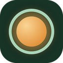

<h1 align="center">OpenFocus</h1>

  <b>Take one slow breath before you scroll.</b> 
  A free, open source alternative to <a href="https://one-sec.app">one sec</a>, made for Chrome.

  <a href="#add-openfocus-to-chrome"><b>Add it to Chrome</b></a> ·
  <a href="#features"><b>Features</b></a> ·
  <a href="#questions"><b>Questions</b></a> ·
  <a href="#thank-you-one-sec"><b>Credit to one sec</b></a>

  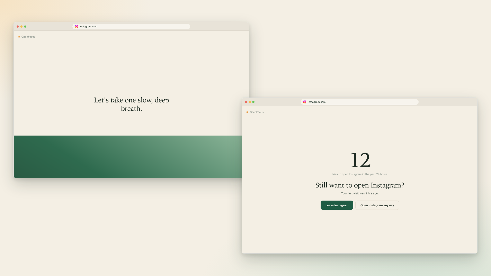

## What is OpenFocus?

Some sites pull you in before you notice. You open a new tab, type "insta" out of habit, and twenty minutes are gone.

OpenFocus puts a short pause in front of those sites. A calm green wave rises and falls on the screen while you take one slow breath. When the breath ends, you choose what to do. Leave, or open the site on purpose.

That small pause gives your brain time to catch up with your hands. Each time you walk away, OpenFocus counts the time you win back.

Every feature is free. You do not need an account, and your data stays on your computer.

> OpenFocus is inspired by [one sec](https://one-sec.app), and full credit for the idea goes to the one sec team. OpenFocus includes all the paid features of one sec, free for everyone. [Read more below](#thank-you-one-sec).

## How it works

1. You pick the sites that take too much of your time, like Instagram or YouTube.
2. When you open one of them, OpenFocus covers the page before anything shows.
3. You breathe along with the wave for a few seconds.
4. OpenFocus shows how many times you tried to open the site in the past 24 hours. Then you decide to leave or to go in.

## Screenshots

<table>
  <tr>
    <td width="50%" valign="top">
      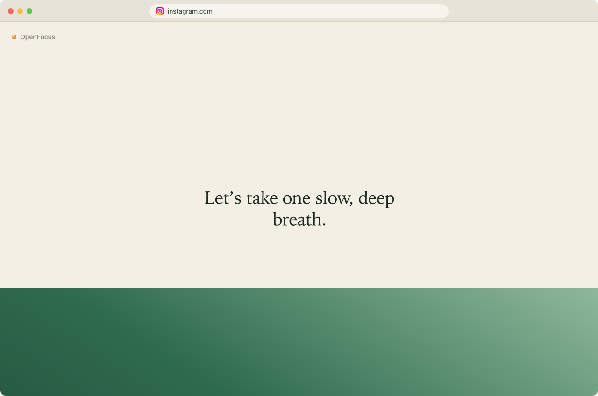
       <b>Rising Tide</b> A green wave rises as you breathe in and sinks as you breathe out.
    </td>
    <td width="50%" valign="top">
      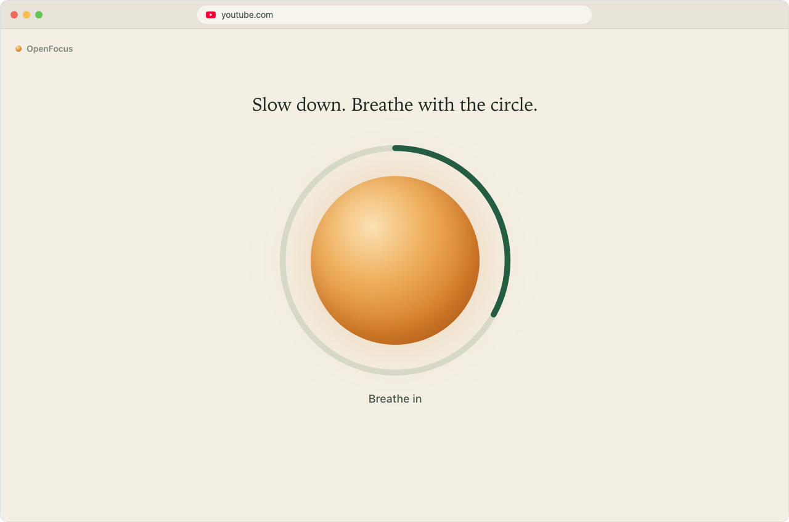
       <b>Breathing Orb</b> Breathe in and out with a glowing circle.
    </td>
  </tr>
  <tr>
    <td width="50%" valign="top">
      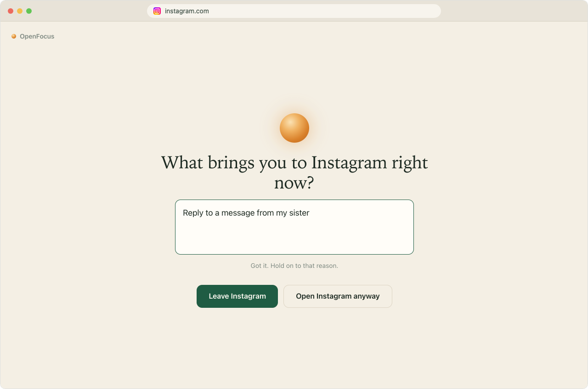
       <b>Name Your Why</b> Write down what you came to do before the site opens.
    </td>
    <td width="50%" valign="top">
      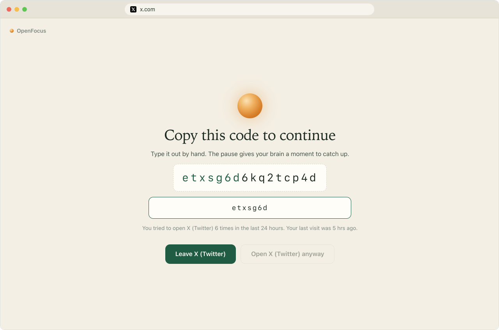
       <b>Copy the Code</b> Type a short random code by hand. Pasting it does not work.
    </td>
  </tr>
  <tr>
    <td width="50%" valign="top">
      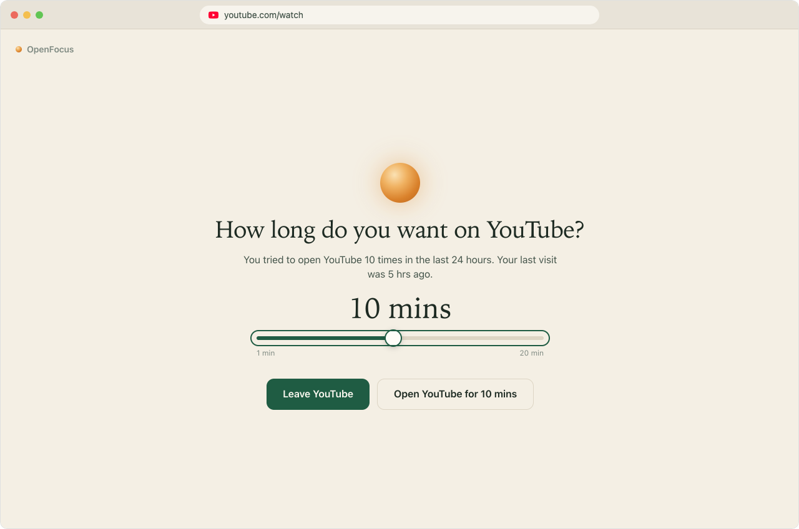
       <b>Ask me each time</b> Pick how many minutes you want before you go in.
    </td>
    <td width="50%" valign="top">
      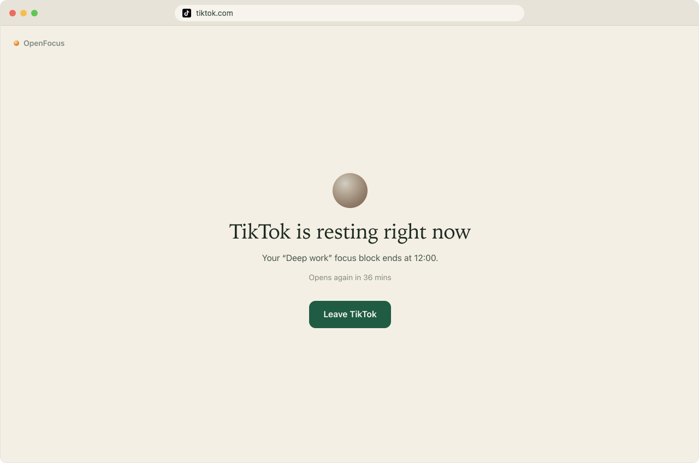
       <b>Focus blocks</b> At the times you set, the site stays closed until the block ends.
    </td>
  </tr>
  <tr>
    <td width="50%" valign="top">
      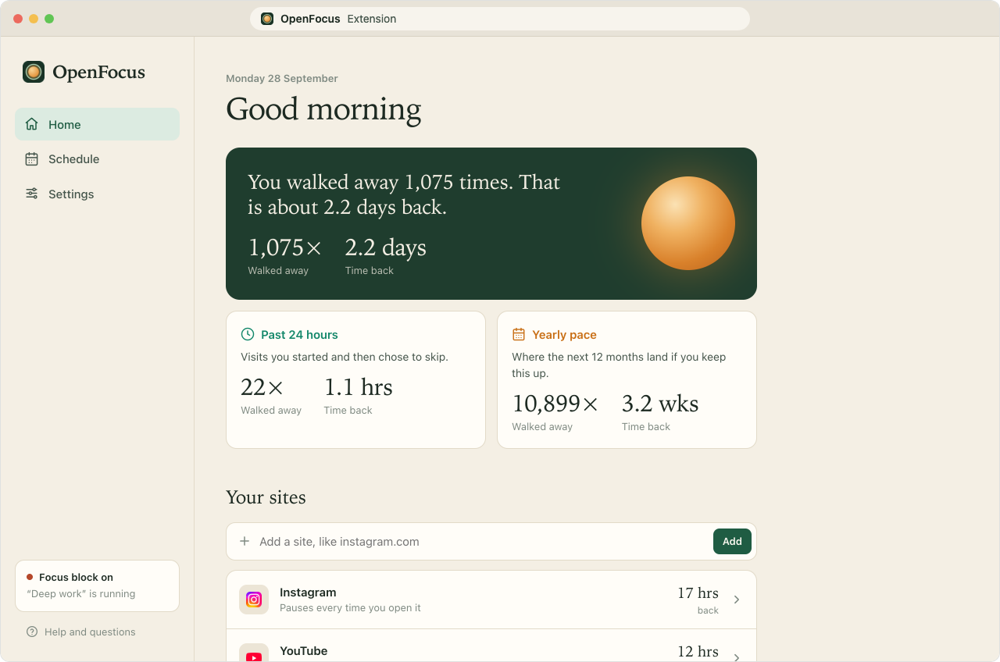
       <b>Home</b> See how often you walked away and how much time you won back.
    </td>
    <td width="50%" valign="top">
      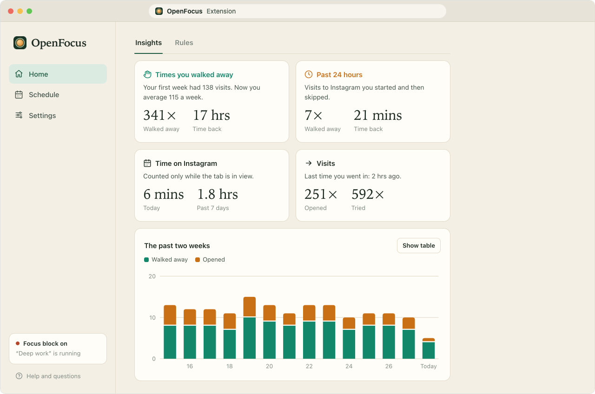
       <b>Insights</b> Each site gets a chart that shows how your habit changes.
    </td>
  </tr>
  <tr>
    <td width="50%" valign="top">
      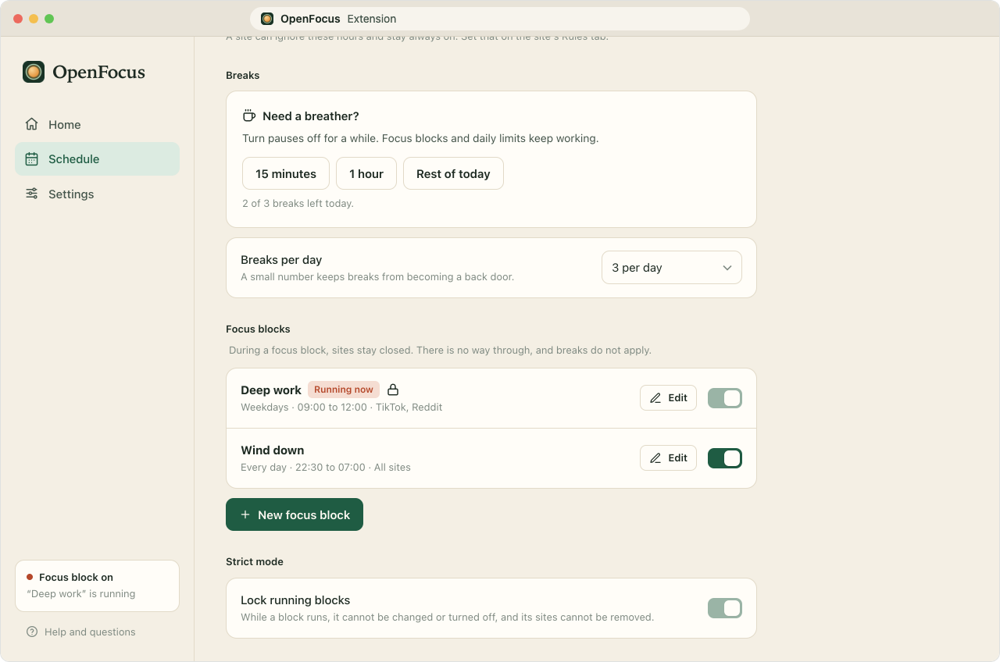
       <b>Schedule</b> Take a short break, or plan the hours when sites stay closed.
    </td>
    <td width="50%" valign="top">
      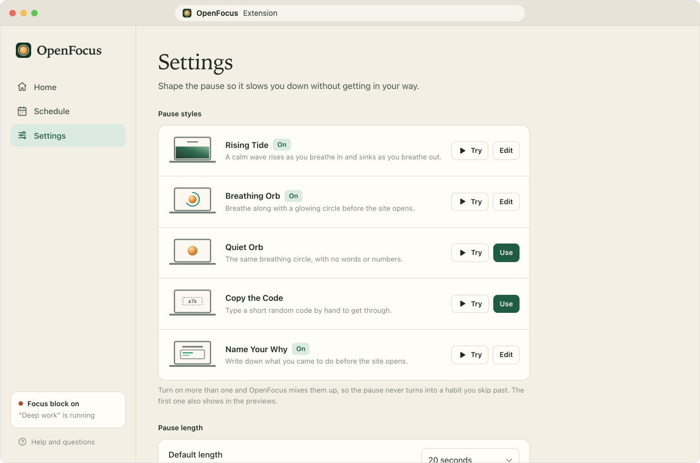
       <b>Settings</b> Choose your pause styles. You can try each one first.
    </td>
  </tr>
</table>

## Features

### The pause

- **No peeking:** The page stays hidden from the first moment, so the feed never flashes on screen. Videos and sound stay paused too.
- **Rising Tide:** A calm green wave moves up and down the screen while you breathe.
- **Breathing Orb:** A glowing circle grows and shrinks, and a ring shows how much time is left.
- **Quiet Orb:** The same circle with no words or numbers on the screen.
- **Copy the Code:** You type a short random code to get in. Copy and paste are blocked.
- **Name Your Why:** You write down why you want to open the site. You can read your answers later.
- **Mix them up:** Turn on more than one style, and OpenFocus picks a different one each time. That way you never learn to skip past it.
- **Your own words:** Change the message on the pause screen to anything you like.
- **Your tries:** The pause screen shows how many times you tried to open the site in the past 24 hours.

### Rules for each site

- **Right away:** Pause every time you open the site.
- **After a few minutes:** Use the site freely for a few minutes each hour. The pause comes after that.
- **Ask me each time:** Slide to the number of minutes you want, then go in. The slider always starts at 1 minute.
- **Pause length:** Make the pause anywhere from 3 to 60 seconds.
- **Longer each try:** The pause grows by 2 seconds for each visit in the past 24 hours, up to 40 seconds more.
- **Free time after the pause:** Choose how long a site stays open after you go in. Pick this visit only, or up to one hour.
- **Check-ins:** After some time on a site, OpenFocus pauses you again to ask if you want to keep going.
- **Daily limit:** After a set number of visits, the site stays closed until midnight.
- **Part of a site:** Pause only one part of a site, like YouTube Shorts. You can also keep some parts open, like a page you need for work.
- **Close the tab:** When you choose to leave, OpenFocus can close the tab for you.

### Schedule

- **Active hours:** Choose the days and hours when OpenFocus is on, like weekdays from 9:00 to 18:00.
- **Late nights:** A time window can run past midnight, like 22:00 to 02:00.
- **Breaks:** Turn pauses off for a while, from 15 minutes up to the rest of the day.
- **Break limit:** Set how many breaks you can take each day.
- **Focus blocks:** Keep sites fully closed at set times, with no way in. Use them for deep work or for winding down at night.
- **Strict mode:** While a focus block runs, you cannot change it or turn it off.

### Progress

- **Time back:** OpenFocus counts 3 minutes for each time you walk away and adds it all up.
- **Past 24 hours:** See how many visits you skipped since this time yesterday.
- **Yearly pace:** See how much time you could win back in a year at your current pace.
- **Two-week chart:** Each site shows the visits you skipped and the visits you opened, day by day.
- **Time on site:** See how long you spent on each site today and over the past week.
- **Your reasons:** Read what you wrote on the Name Your Why pause.

### Privacy and control

- **Stays on your computer:** Your sites and history are saved in Chrome on your computer. OpenFocus sends nothing anywhere.
- **No sign-up:** You do not need an account or an email address.
- **Toolbar menu:** Click the OpenFocus icon to see your time back, take a break, or pause the site you are on.
- **Backups:** Save your settings to a file. Load it again later or on another computer.
- **Clear history:** Delete all your counts and charts whenever you want. Your settings stay.

## Add OpenFocus to Chrome

OpenFocus is not in the Chrome Web Store yet, so you add it by hand. It takes about two minutes, and you do not need to know how to code.

### Step 1: Download OpenFocus

1. Click this link: **[Download OpenFocus (ZIP file)](https://github.com/preeteshjain/openfocus/archive/refs/heads/main.zip)**. 
   You can also click the green **Code** button at the top of this page and choose **Download ZIP**.
2. Open your Downloads folder and unzip the file.
   - On a Mac, double-click the file.
   - On Windows, right-click the file and choose **Extract All**.
3. You now have a folder named **openfocus-main**. Move it somewhere safe, like your Documents folder.

> [!IMPORTANT]
> Keep this folder. Chrome runs OpenFocus from it. If you delete the folder, OpenFocus stops working.

### Step 2: Turn on Developer mode

1. Open Chrome.
2. Type `chrome://extensions` in the address bar at the top and press **Enter**.
3. Find the **Developer mode** switch in the top-right corner and turn it on.

Developer mode lets Chrome add an extension from a folder on your computer. You can leave it on.

### Step 3: Add OpenFocus

1. Click the **Load unpacked** button in the top-left corner.
2. Choose the **openfocus-main** folder and click **Select**. On Windows, the button says **Select Folder**.
3. OpenFocus shows up in your list of extensions, and its home page opens in a new tab.

### Step 4: Pin it to your toolbar

1. Click the puzzle piece icon at the top right of Chrome.
2. Click the pin next to **OpenFocus**.

The OpenFocus icon now stays in your toolbar.

### Step 5: Add your sites

On the OpenFocus home page, type a site like `instagram.com` and click **Add**. Then open that site in a new tab. The pause shows up.

If you close the home page, click the OpenFocus icon and choose **Open dashboard** to get back to it.

### Optional: cover Incognito windows

Chrome keeps extensions out of Incognito windows until you allow them. On `chrome://extensions`, click **Details** under OpenFocus and turn on **Allow in Incognito**.

### Other browsers

OpenFocus is made for Chrome. Microsoft Edge and Brave can load it the same way. Type `edge://extensions` or `brave://extensions` in place of `chrome://extensions`. In Edge, the Developer mode switch is on the left side of the page.

## Update to a new version

1. Before you start, save a backup. Go to **Settings**, then **Your data**, then **Save a backup**.
2. Download the new ZIP file and unzip it.
3. Put the new **openfocus-main** folder in the same place as the old one, and replace the old folder.
4. Go to `chrome://extensions` and click the round arrow on the OpenFocus card to reload it.

Everything you set up carries over, history included.

## Remove OpenFocus

Go to `chrome://extensions`, find OpenFocus, and click **Remove**. Chrome deletes your OpenFocus data at the same time.

## Questions

**Is OpenFocus free?** 
Yes. Every feature is free, and anyone can read the code.

**Can I still open a site when I need it?** 
Yes. After the pause, you can always choose to open the site. A site stays closed only during a focus block or after its daily limit, and you set both of those yourself.

**Why does Chrome say OpenFocus can "read and change" data on websites?** 
OpenFocus needs this to cover any site you add to your list. It runs only on the sites on your list. It does not read what you type, and it sends no data anywhere.

**Does it work on my phone?** 
No. OpenFocus runs in Chrome on a computer. On your phone, try [one sec](https://one-sec.app), the app that inspired OpenFocus.

**Where is my data?** 
In Chrome, on your computer. OpenFocus has no server and no account, so nobody else can see it.

**Why is the page blank for a moment?** 
OpenFocus hides the page while it checks your rules. This way the feed never flashes on screen.

**The pause does not show up. What do I do?** 
Check that the site is on your list on the OpenFocus home page. Then click the OpenFocus icon and look at the status. You may be outside your active hours, or you may be on a break.

## Thank you, one sec

OpenFocus is an open source alternative to [one sec](https://one-sec.app). Full credit goes to one sec and its team, because this extension was inspired by their work. The idea of a breathing pause before a distracting app comes from them.

OpenFocus includes all the paid features of one sec and gives them to everyone for free.

OpenFocus is an independent project with no link to one sec or its makers. If you like the idea, please support the one sec team. Their app also works on phones and tablets.

## For developers

OpenFocus is plain JavaScript with no build step. Edit a file, then click the reload arrow on the extension card.

- `src/background.js` checks each page against your rules and decides what to show.
- `src/content/` hides the page early and draws the pause screen.
- `src/dashboard/` holds the pages where you set things up. `src/popup/` is the toolbar menu.
- `src/lib/` holds the shared logic for schedules, site matching, history and storage.

Bug reports and ideas are welcome. Open an issue on this page to share them.

## License

OpenFocus uses the [MIT License](LICENSE). You can use it and change it however you like.
